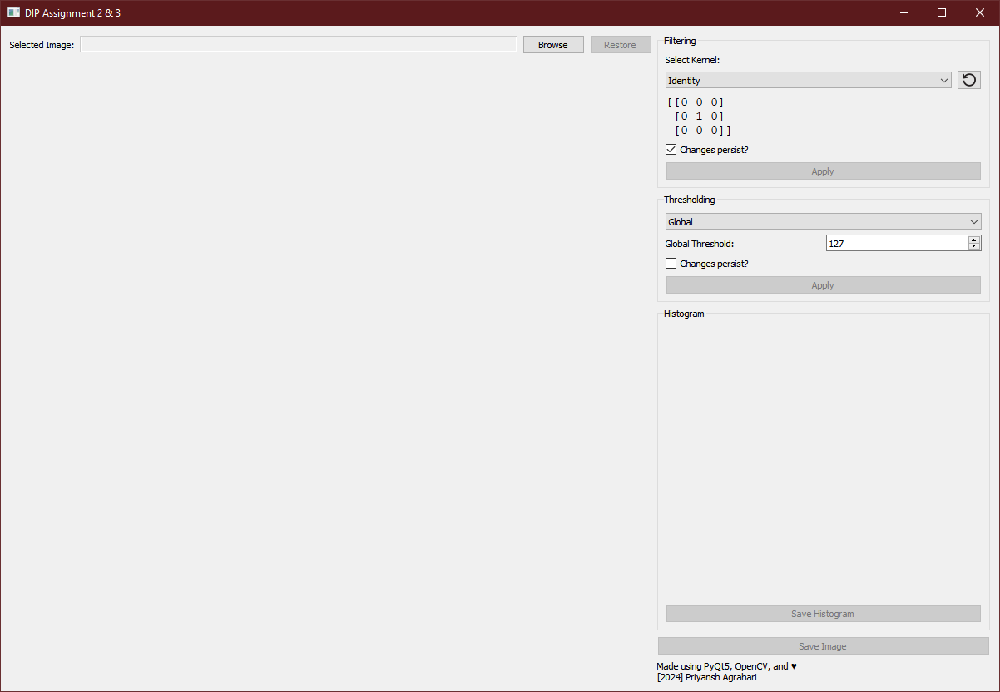
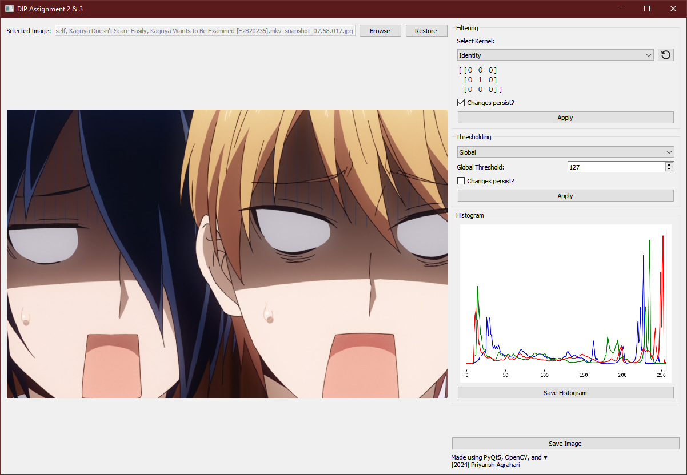
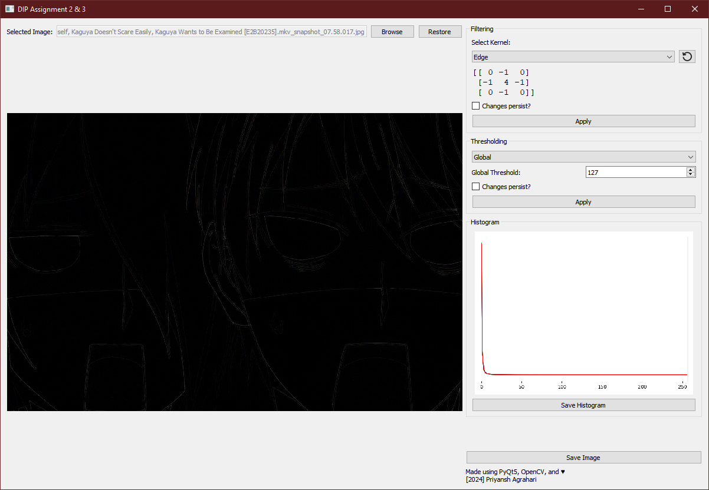
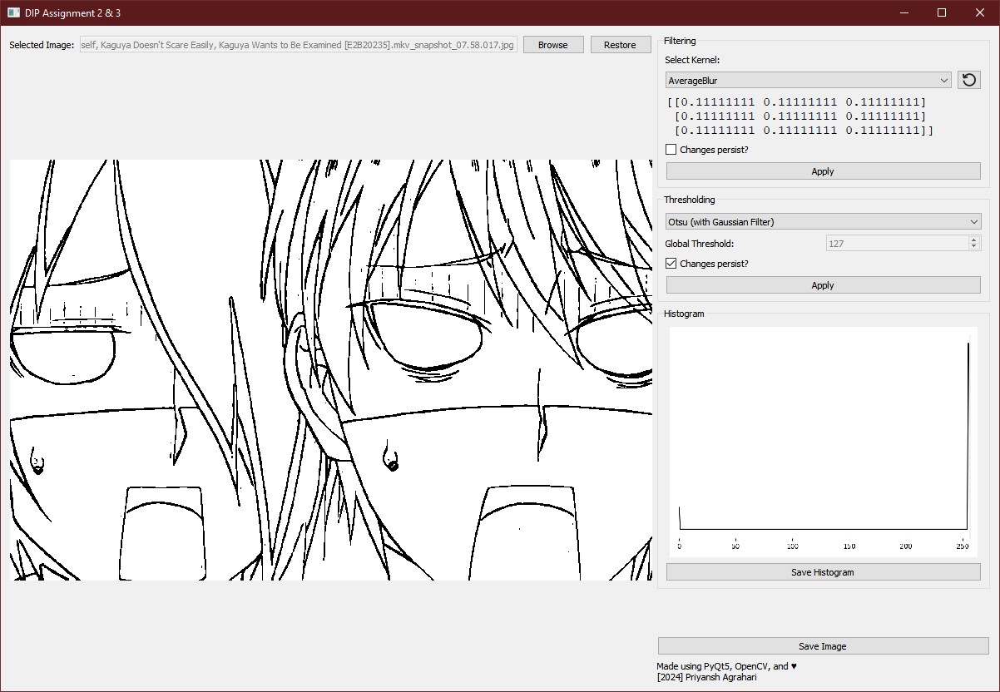

# Image Filtering and Thresholding using OpenCV and PyQt5

## Supported operations

### Filtering  
Includes the following kernels for filtering:
1. Identity
2. Edge
3. Sharpen
4. Blur (average and gaussian)
6. Custom - enter any matrix and apply onto image

### Thresholding
Includes the following thresholding methods:
1. Global - manually set threshold
2. Adaptive (mean and gaussian)
3. Otsu (direct and with gaussian blur)

## How to use

### Method 1 - download release and run (Windows only)  
you'll find it on the right side of the git repo page

### Method 2 - run in python virtualenv  
1. set up the venv `python -m venv .venv`
2. activate the venv using one of the appropriate scripts inside the `.venv/Scripts/` directory
3. install the required dependencies `pip install -r requirements.txt`
4. finally, run it using `python main.py`

#### To build using PyInstaller
`pyinstaller --name='<whatever you want>' --windowed --onefile --add-data "undo-arrow.png;." main.py`

## Screenshots

- First launch  

- After loading an image  

- Applying edge filter  

- Applying gaussian adaptive thresholding  

- After a few iterations of otsu's thresholding  
 

## Credits

- Undo Arrow Icon - <a href="https://www.flaticon.com/free-icons/reset" title="reset icons">Reset icons created by Freepik - Flaticon</a>, [Icon used](https://www.flaticon.com/free-icon/undo-arrow_82004)
- Anime in the screenshots - [Kaguya sama](https://myanimelist.net/anime/37999/Kaguya-sama_wa_Kokurasetai__Tensai-tachi_no_Renai_Zunousen) :)

## Disclaimer

This was made within a day for an assignment, may have bugs, though i've tried to smash any i could find. Any bug reports and feature suggestions are welcome.